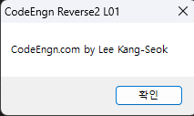
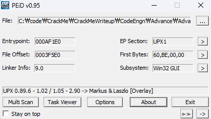
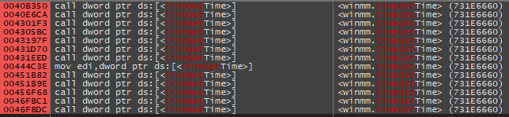
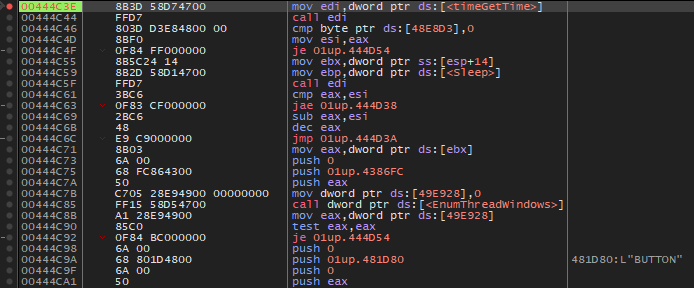
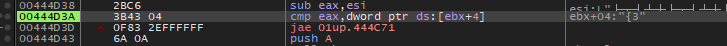
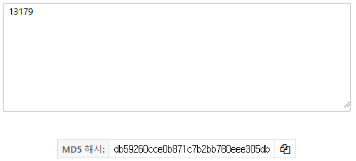

# 이 프로그램은 몇 밀리세컨드 후에 종료 되는가. 정답인증은 MD5 해쉬값(대문자) 변환 후 인증하시오

  
실행하면 이런 창이 떴다가 ??초 후에 사라진다.

  
일단 upx언팩부터 한 후

  
Basic L19에서 유사한 문제를 `timeGetTime`를 통해 해결했으므로 이번에도 이것부터 먼저 본다.

  
L19의 프로그램이랑 똑같은 코드 흐름이다.  
`timeGetTime`을 처음 호출한 시간을 저장하고 루프를 돌면서 `timeGetTime`을 재차 호출하고 첫 시간과 비교하는 코드이다.

  
[ebx+04]=337B 이므로 십진수로 13179이고 이를 MD5로 변환하면

  
정답은 **db59260cce0b871c7b2bb780eee305db**
