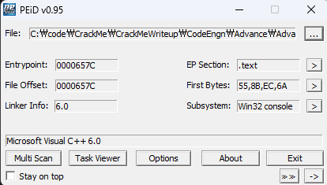
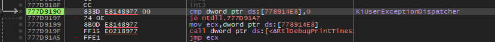
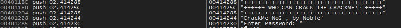
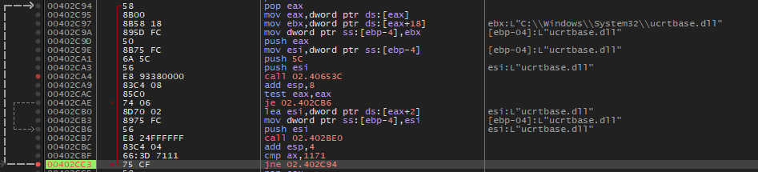
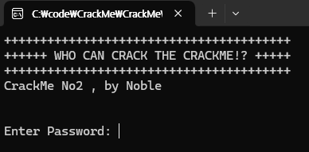
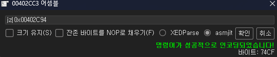
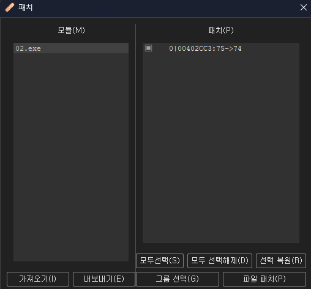
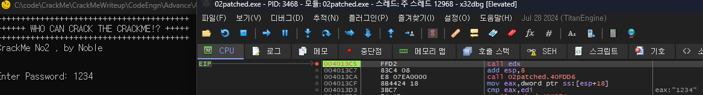
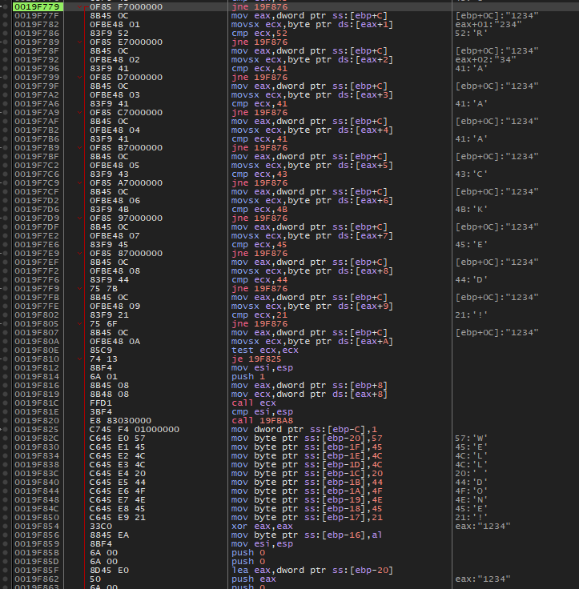
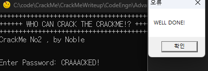

# 정답은 무엇인가

  
peid결과 특별한 점은 없고 실행하면 바로 꺼진다.

  
디버거를 붙여도 바로 KiUserException으로 튕겨버린다. 검색해보니 Win7에서는 정상적으로 실행된다고 한다.

  
일단 문자열을 찾아봤고 원래 정상적으로 출력되었어야 할 "Enter Password: "가 보인다. bp를 걸어봤지만 도달하지 못하고 종료된다.

  
코드를 따라가면서 종료 지점을 찾아보니 `402CC3`에서 여러 system32 dll들을 순회하다가 `402CA4의 call 02.40653C`에서 종료되는 것을 확인했다.

  
`402CC3`에서 jne의 ZF를 1로 조정하여 해당 루프를 탈출했더니 아까 걸었던 password bp에 걸려 출력에 성공한 모습이다!! Win7 설치하기 싫어서 노력한 보람이 있다.

  
해당 루프를 무조건 탈출하도록 jz로 바꾸고

  
win11에도 호환되도록 패치를 진행했다.

  
패치된 파일을 다시 디버거로 열어서 비밀번호에 1234를 넣고 진행하다보면 `4013C5`에서 `call edx`를 하면서 종료된다.
해당 함수로 들어가보자.

  
좀 진행하면 입력한 패스워드와 CRAAACKED!를 비교하다가 실패시 아래에 보이는 WELL DONE! 을 넘가는 모습이다. 아마 이게 패스워드이지 않을까?

  
웰던이 떴으니 정답  
WIN11에서는 까다로운 문제였다.  
정답은 **CRAAACKED!**
