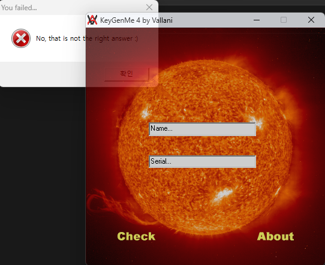
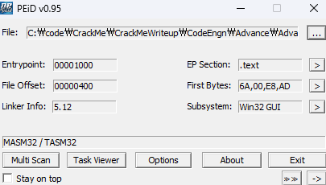
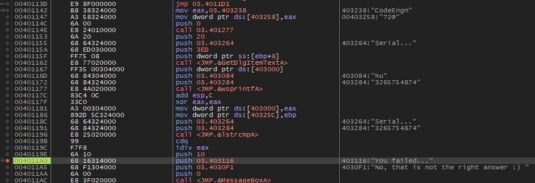
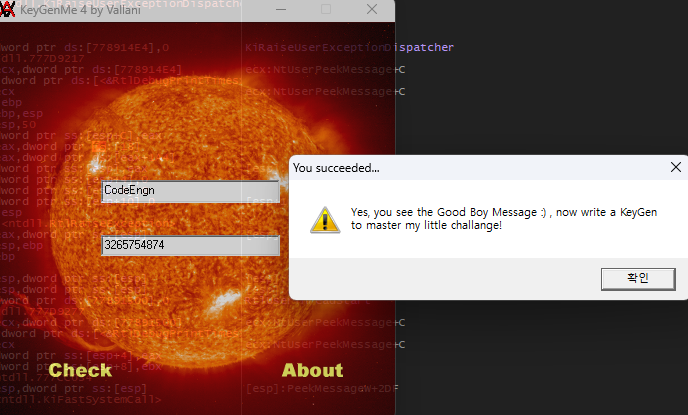

# Name이 CodeEngn 일때 Serial은 무엇인가

  
실행화면이다. 두 문자열을 비교하는것이 핵심인듯 하다.

  
따로 패킹은 없다. Name에 CodeEngn을 넣고 시리얼 값을 찾아보자.

  
문자열 검색을 통해 You failed를 찾고 bp를 걸었더니 해당 코드로 이동했다. Serial...과 `403284:"3265754874"`를 비교하는데 해당 값을 넣고 다시 실행해본다.

  
이게 왜 Advanced..?
정답은 **3265754874**
