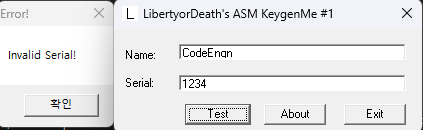
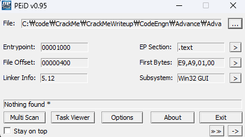
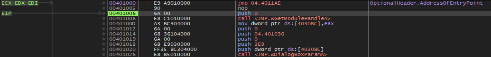
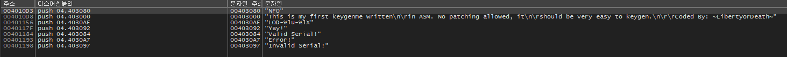
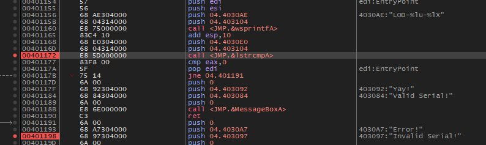
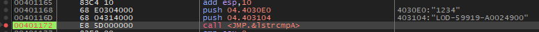
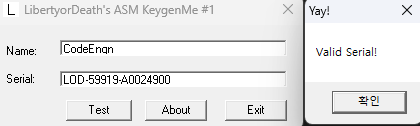

# Name이 CodeEngn 일때 Serial은 무엇인가

  
  
아마 패킹은 없는듯 하다. 일단 디버거로 켜보자.

  
뭔가 알 수 없는 패킹이 되어있었다.  
`401000`에서 시작했으나 바로 `4011AE`로 점프하고 루프를 돌면서 압축을 해제하고 다 끝나면 `401006`으로 이동한다. 여기가 OEP라고 봐도 될 것 같다.  
이동한 후에 문자열도 복원되므로 확인해보면

  
다음과 같고 여기서 Serial 문자열을 따라가 보면

  
두 문자열을 비교하는 lstrcmpA가 보인다. bp를 걸고 동작을 본다.

  
입력한 시리얼인 "1234"와 "LOD-59919-A0024900"를 비교한다. 저게 정답일듯 하다.

  
정답은 **LOD-59919-A0024900**
