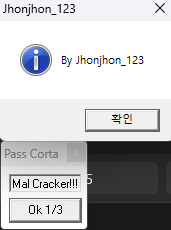
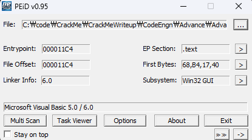
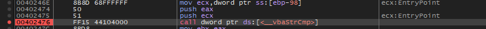
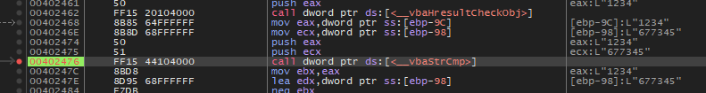
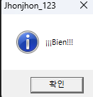

# Serial 을 구하시오

  
아무 값이나 입력하고 Ok 1/3을 누르면 이런 화면이 뜬다.

  
패킹은 없고 visual Basic인 것을 확인

  
문자열 비교 함수를 찾아서 BP를 걸고 실행

  
첫 Serial은 677345가 유력하다 넣어보자.

  
이런 창이 뜨면서 일단 넘어갔다. 다음 시리얼을 알아보자.
라고 생각했는데 창이 그냥 꺼졌다.

Ok 1/3이라 해서 3번 맞춰야 하는 줄 알았는데 그냥 이게 정답이었다...

정답은 **677345**
