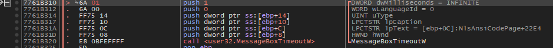

# 남은 군생활은 몇일 인가. 정답인증은 MD5 해쉬값(대문자) 변환 후 인증하시오

  
UPX 언팩 후 진행

  
실행하면 확인 누를 때 마다 숫자가 증가하며 아마 끝나기 직전의 숫자가 정답인 듯 하다.  
python으로 매크로 돌려서 깨도 될듯 하고, 아니면 치트엔진으로 값을 조작해보는 것도 괜찮을 것 같다.

  
일단 디버거를 먼저 켜보고 메세지 박스 호출 시점을 살펴본다.

  
일단 여기서 메세지 박스가 출력되고 ebp에 카운트에 해당하는 문자열을 찾았다.  
트레이싱해보면서 흐름을 파악하려 했으나 비교문 분기문이 너무 많고 양이 방대해 다른 방법을 찾았다.

  
먼저 MessageBoxTimeouw의 dwMilliseconds를 INFINITE에서 1로 패치해 확인 버튼누르는 노가다를 없애고

  
이러면 확인 창이 보이지도 않고 꺼진다.

  
해당 중단점의 히트 수를 기록하면 카운트를 알 수 있다.

  
중단점에서 멈추지 않도록 중단 조건을 비활성화 해준 후

  
프로세스 종료하는 함수들에 전부 bp를 걸어준다음 실행하면

  
잠깐의 시간 후 ExitProcess에 bp가 걸렸고 MessageBoxW는 총 790번 실행된 것을 확인했다.  
고로 정답은 **790**
