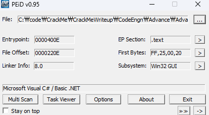
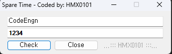
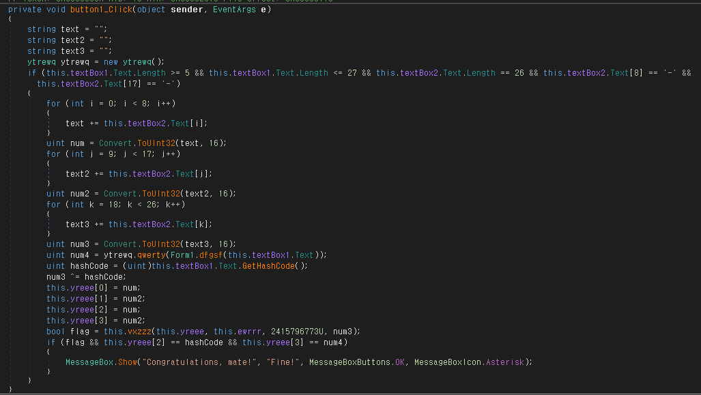
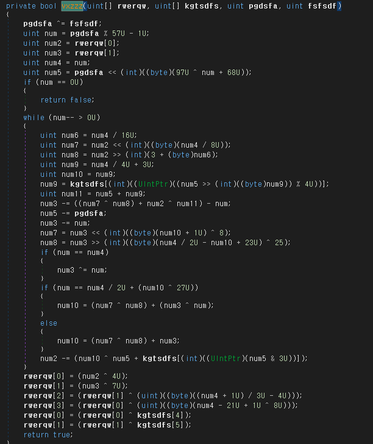
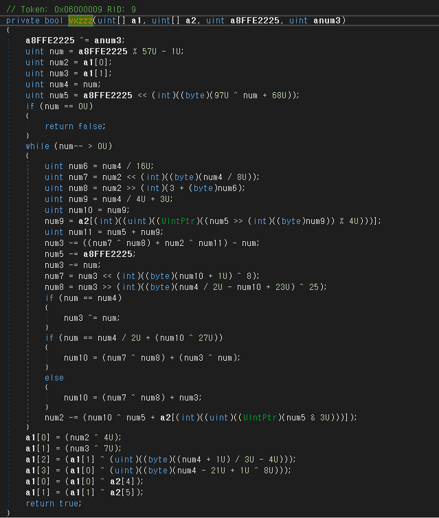
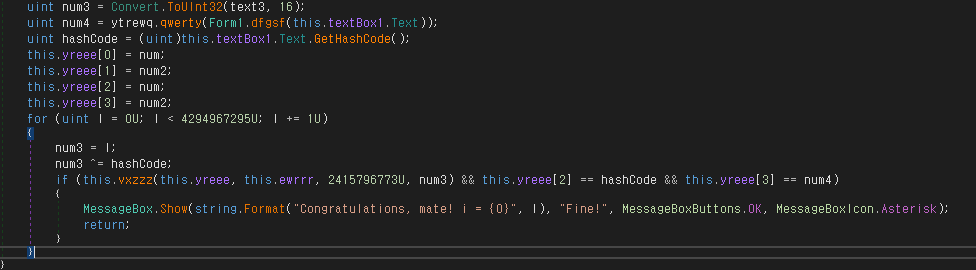

# Name이 CodeEngn일때 Serial은 28BF522F-A5BE61D1-XXXXXXXX 이다. XXXXXXXX를 구하시오

  
닷넷 확인 dnspy를 쓰면 되겠다.

  
실행하면 이와 같고 Check를 눌러도 Serial이 틀리면 별 반응이 없다.

  
Check 버튼을 누를 때의 코드이다.  
textBox1이 Name, textBox2가 Serial입력이다.  
Serial이 '-'으로 구분되어 세 부분으로 나뉘는데 왼쪽부터 text, text2, text3이고  
ToUInt32로 문자열 16진수를 UInt32로 변환하여 num, num2, num3에 저장한다.  
그 후 num4를 name을 인자로 몇몇 함수들을 거쳐 num4를 생성한다.  
Name에서 hashCode를 생성하고 num3에 xor연산한 값을 저장한다.  
vxzzz를 통해 flag를 생성하고, 해당 플래그가 참이며 num==hashCOde이고 num2==num4이면 성공

flag가 제일 중요해보이니 먼저 vxzzz 코드를 열어봤다.

  
난독화 되어 있어 읽기 쉽지 않은 모습이다.  
코드 정리를 좀 하면

  
이래도 잘 모르겠다 사실 이미 시리얼 앞 두자리를 줬기 때문에 XXXXXXXX는 충분히 Brute Force 방식으로 풀 수 있다.  
코드를 살짝 수정하면

  
이제 체크 버튼을 누르면 3번째 시리얼이 어떤 값이든 정답이 나올 때 까지 Brute Force 하여 정답을 출력해준다.
첨부된 07.exe는 해당 패치가 적용된 버전이다. 문제는 32비트와 64비트의 GetHashCode()가 다르게 작동해서 64비트 환경에서는 답을 알 수가 없다. 32비트에서 실행해야 한다.  
어쨌든 정답은 **11E051D1**
