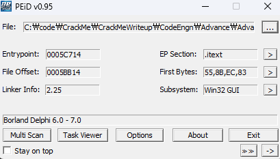

# Key 값이 5D88-53B4-52A87D27-1D0D-5B09 일때 Name은 무엇인가. 힌트 : Name은 두자리인데.. 알파벳일수도 있고 숫자일수도 있고.. 정답인증은 Name의 MD5 해쉬값(대문자)

  
아마도 패킹 없음 Delphi 확인

  
디버거를 붙여서 실행해보면

  
문자열 탐색을 통해 Good Boy와 Well Done을 찾을 수 있고 해당 코드로 분기하는 곳을 찾아보면

  
`0045BBA9`에서 `jne`로 점프하는 것을 볼 수 있다. 일단 BP를 걸고 실행해 봤으나 걸리지 않는다 더 위에서 해당 코드 자체를 넘어가는 것 같아 좀 더 찾아봤다.

  
`0045BB39`의 `jmp`와 `0045BB73`의 `jmp`를 모두 우회해야 정답 조건 체크가 가능하다.  
해당 조건을 우회하기 위한 조건을 알아보니 Name이 length가 3이상 30이하여야 한다.  
그 경우 정답 조건 체크까지 진행할 수 있다.

  
일단 문제에서 Name이 두자리라고 했기 때문에 해당 조건을 2이상 일 경우로 패치해준 후 다시 분석한다.

  
중간중간 `jmp` 뒤에 존재하는 `call 08.43A074` 도 혹시 몰라 분석해보니 그냥 문자열을 Name에 입력해주는 함수인 듯 하다.  
정답 분기 직전에 실행되는 함수를 들어가보면 아래와 같다.

  
우리가 입력한 Key값인 5D88... 와 입력한 적이 없는 F23A... 가 보인다. 단순히 두 문자열을 비교하는 것으로 보아 여기는 Name을 토대로 이미 생성된 어떤 Key를 입력한 Key와 비교하여 ZF를 설정하는게 전부인 것으로 보인다.

  
결국 `call 08.45B850`를 분석하여 어떤 Name일때 정답이 되는지 찾아야 한다. 경우의 수가 작아서 Brute Force도 충분히 유효하나 일단 한번 분석해보기로 했다.

  
`call 08.45B850`의 내부를 따라가다 보면 아까 봤던 Key값이 보인다. 하지만 분석해보니 생성은 위에서 하는 듯 하다.  
다시 위로 올라가서 익숙한 키 값들을 관찰해보면 다음과 같다.

  
여기서 ESI에 F23ABBF0를 생성하고

  
EBP-10에 058E6768 생성

  
`call 08.45B54C`에서 키 중간 값을 생성

  
EDI에 다음 값

  
여기서 마지막 값을 생성한다.

내가 원하는 건 Name이기 때문에 5가지 중 하나만 역산할 수 있어도 Name은 획득할 수 있다.
첫 번째 알고리즘을 다시 살펴보면
Name = "AA" 일 때

```python
    Name[0] *= 0x772
    Name[0] += Name[0] * Name[0]
    Name[0] *= 0x474
    Name[0] += Name[0]

    Name[1] += Name[0]
    Name[1] *= 0x772
    Name[1] += Name[1] * Name[1]
    Name[1] *= 0x474
    Name[1] += Name[1]
    Key = Name[1]
```

처음엔 역산하려 했는데 4바이트 넘는 값이 오버플로우 되는 것을 고려해서 역산하기가 여간 까다로울 것 같아서 결국 해당 조건에 맞게 Brute Force를 통해 구했다.

  
코드는 `solve.py`를 참고

정답은 **"C6"**
