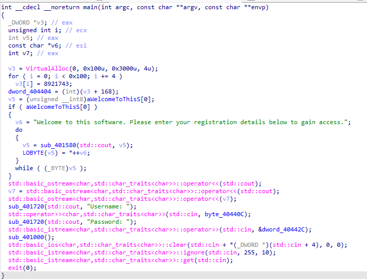
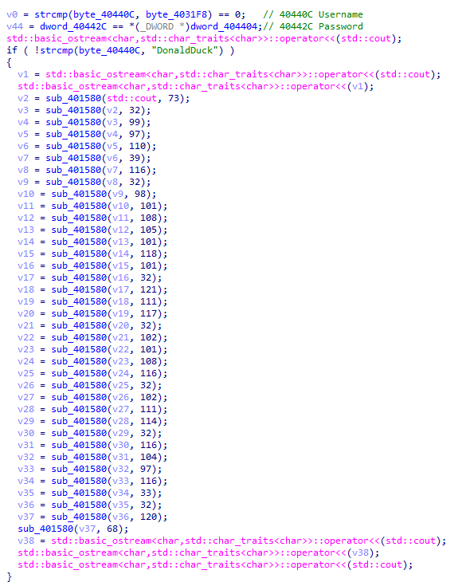
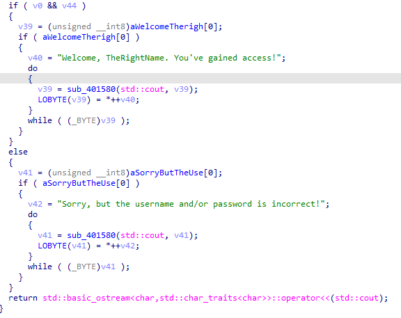

# Password는 무엇인가

  
간단한 콘솔 프로그램이다.

`v3`에 `VirtualAlloc`으로 Heap 영역을 할당한 후 for 문을 거치면서 `8921743`이라는 값을 4바이트마다 넣어 주는 모습이다.

그 후 `dword_404404`에 앞서 할당한 Heap 영역의 시작점에서 `0xA8*4` 만큼 더한 주소를 대입한다. 앞서 `0x100*4` 만큼의 영역에 `8921743`을 뿌렸으므로 여기를 참조하면 `8921743`이 들어있다는 것을을 알 수 있다.

그 후 환영 문구를 출력하고 "Username"과 "Password"를 입력받는데
각각 `40440C`와 `40442C`에 입력받는다.

그 후에 `sub401000`을 실행한 후 종료한다.

일단 앞선 정보들을 가지고 `sub_401000`을 디컴파일 해서 분석해보겠다.

  
일단 if문에서 Username과 DonaldDuck이 일치하는지 검사한 후 무언가 일어난다. 일단 복잡해보이니 아래를 보면

  
`v0`와 `v44`를 동시에 만족할 경우 성공 메세지를 출력하는 것을 알 수 있다.  
`v0`는 `strcmp(byte_40440C, byte_4031F8) == 0;` 이므로 즉 입력한 Username이 `4031F8`의 값과 같은지를 확인하고,  
`v44`는 `dword_40442C == *(_DWORD *)dword_404404;` 이므로 입력한 Password가 `404404`의 주소를 참조한 값과 같은지 확인한다.

`4031F8`에는 ida 상으로는 0밖에 없다. 하지만 문제에서 물어보는 것은 Password 이니 중요하지 않다.  
`404404`의 경우 해당 주소를 참조하면 앞서 main함수에서 파악한 대로 `8921743`이 있을 것이다.

성공 문자열을 출력하기 위해서는 Password가 `8921743`이어야만 한다.

따라서 정답은 **`8921743`**
