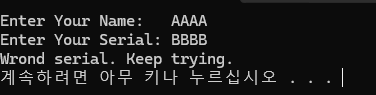
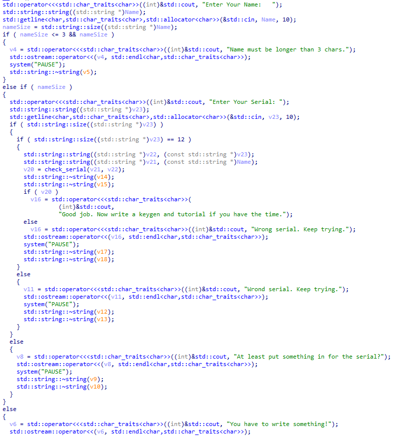
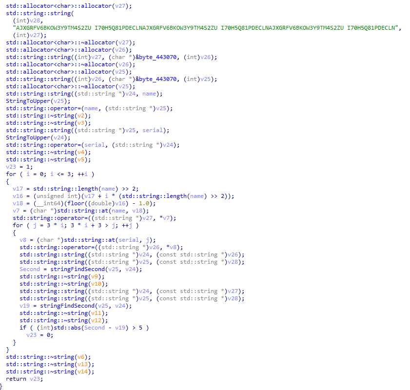
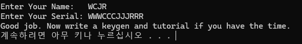

# Serial이 WWWCCCJJJRRR 일때 Name은 무엇인가. Hint 1 : 4글자, Hint 2 : 정답으로 나올 수 있는 문자열 중 (0~9, a~z, A~Z) 순서상 가장 먼저 오는 문자열

  
Name과 Serial을 입력받아서 성공 여부를 체크하는 프로그램이다.  
문제에서 시리얼은 `WWWCCCJJJRRR`으로 주어졌고, Name은 4글자이며 여러개의 성공 Name중 사전 순으로 가장 앞선 Name이다.  
먼저 ida로 뜯어보았다.

  
길지만 별거 없다.  
Size가 3이상인 Name을 입력받으면 Serial을 입력받는다.  
그 후 check_serial 함수를 통해 Name과 Serial을 비교하여 결과 값을 `v20`에 저장하고 해당 값이 0이 아니면 성공 문자열을 출력한다.

check_serial을 분석해보자.

  
"AJXGRFV6BKOW3Y9TM4S2ZU I70H5Q81PDECLNAJXGRFV6BKOW3Y9TM4S2ZU I70H5Q81PDECLNAJXGRFV6BKOW3Y9TM4S2ZU I70H5Q81PDECLN"  
위 문자열을 code라 하자.

먼저 name 문자열을 복사한 후 StringToUpper 함수로 대문자로 변환하고 다시 name에 저장한다.  
serial 문자열도 동일한 방식으로 대문자로 변환한다.

루프는 4번 반복(i = 0; i <= 3)하며 각 반복에서 다음 작업을 수행한다.  
name을 4등분한 부분에서 특정 문자를 추출
serial 에서도 대응되는 문자 3세트를 추출  
stringFindSecond 함수로 두 문자열의 특정 위치를 찾고 비교  
두 위치 차이가 5보다 크면 `v23 = 0`으로 설정하여 검증 실패

  
문제에서 주어진 Serial은 `WWWCCCJJJRRR` 인데 3세트를 추출하는 것을 감안하면 묘하다.
느낌이 가는 대로 Name을 WCJR로 놓고 돌려보면 정확히 알고리즘과 일치한다.  
정답은 **WCJR**
