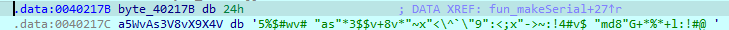

# Serial이 94E7DB1B 일때 Name은 무엇인가. 해당 Serial에 대한 정답이 여러개 나오는 문제이며 Contact로 보내주시면 인증키를 보내드리겠습니다. 해당 Serial에 대해서 'Serial accepted' 메시지가 나와야 합니다.


문제를 보면 시리얼에 따라 성공하는 Name이 여러개라고 한다.  
일단 간단하게 ida로 열어보면 아래와 같다.

  
메세지 박스 함수들이 보이고 제대로 입력했을 때 `sub_4010EF`로 넘어간다.

  
`sub_4010EF`에서 `sub_401146`에 bp를 걸어 보면 해당 함수 실행 전후로 `realSerial`로 표기한 `00402439`주소에 Name을 토대로 생성한 Serial이 입력되는 것을 확인할 수 있다.  
문제에서 제시한 Serial은 `94E7DB1B`이므로 `sub_401146`을 분석해서 역산해야 한다.

  
해당 문자열을 키 값으로 해서 암호화를 진행하는데 알고리즘이 복잡하여 디컴파일러가 제대로 해석하지 못했다.  
직접 어셈을 보면서 해석해보기로 했다.

  
함수 도입부에서 우리가 찾고자하는 realSerial과 시리얼을 생성할 name의 오프셋을 각각 스택에 저장한 후 반복문을 통해 realSerial을 생성한다.

  
`4011B1`에서 nameOffset을 활용하는 모습을 보고 bp를 걸어 집중 분석했다.  
입력한 Name을 한글자씩 불러와 `sub_4013AB`를 통해 `402538`에 저장한다.

  
Hex dump를 확인해보면 `402530`에 `. . . r` 이 보이는데 `r`은 `sub_4013AB`에 의해서 name에서 불러온 글자를 삽입한 것이다.

  
그렇게 name에서 한 글자씩 꺼내서 암호화를 진행하다 끝에 도달하면 `4011C9`에서 `realSerialOffset`을 사용해서 생성된 암호문을 저장하는 과정을 거친다.
`sub_4013BF`의 경우 `402538`에 접근하여 특정 값을 EAX로 불러온 후 해당 메모리를 0으로 만든다.

  
주석을 정리하면 다음과 같다. 이제 두 분기점에 bp를 걸고 다시 실행하여 `402538`을 관찰하여 어떤 식으로 생성되는지 분석해보려 한다.

`402538`의 첫 시작은 항상 3B 10으로 시작한다.  
첫 호출에는 3B 10에서 시작하여 name의 길이 만큼 변화한다.

간단하게 Name에 1을 넣어보았다.  
결과는 BC F1 0C 00

그렇다면 11을 넣어보면 어떤지 관찰해보니  
BC F1 0C 00 -> 68 A8 19 00

1과 11의 경우 첫 단계는 동일하게 name에서 1이 들어가므로 같은 키 값을 가짐을 확인할 수 있다.

그렇다면 첫 단계가 같은 숫자이면 같은 키 값이 도출되는 것은 알았으니 순서를 바꿔도 같은 값이 나오는지 확인해보기 위해 21과 12를 넣어봤다.

21을 넣으면 28 34 0D 00 -> D4 EA 19 00  
12를 넣으면 BC F1 0C 00 -> D4 EA 19 00

보아하니 최종 키 값의 경우 어떤 순서로 들어가는지는 상관이 없는 듯 하다.  
문제에서 알려준 정답이 여러개일 수 있다는 것은 이것 때문인 듯 하다.

일단 큰 그림으로 살펴보는 것은 한계인 것 같아 세부적으로 들어가보았다.

eax 값에 따라 분기하므로 eax 값을 집중적으로 먼저 살펴보면 다음과 같다.

1. 24 35 25 24 23 76 3C 22 78 7E 22 2A 76  
   초기세팅을 하면 `402538`에 `3B10`이 저장된다.

2. 3E 7E(name != 0) 3A 21 34 23 24 5F 22 6D 64 38 22 47 2B 2A 25 2A 2B  
   `7E`에서 name의 문자열 하나를 불러온 후 각종 연산을 하는데 디버거로 따라가보면 다음과 같다.  
   `(Name의 아스키값)*0x426C`을 `402538`에 더한다. 해당 과정을 Name의 길이만큼 반복한다.

3. 3E 7E(name == 0) 3A 21 34 23 24 5F 24 76  
   `402538`에 저장된 값을 0xF로 나눈 몫과 나머지를 순서대로 저장한다.

4. 3E 38 37 2B 2F 5C 22 30 22 5E 2B 3C 3A 22 39 22 5C 60 5E 5F 22 61 73 22 2A 33 24 2C 76 78 25 3E 2C(realSerial) 2B 6C 3A 21 23 5F  
   (나머지+30)이 9이하인 경우 해당 값을 realSerial에 저장하고 9초과인 경우 8을 더한 값을 저장한다. 그 후 몫에 두배를 곱하고 F로 나눈 새로운 몫과 나머지를 순서대로 저장한다.

5. 40  
   몫과 나머지 모두 0이 되면 40이 호출되면서 종료한다.

파이썬으로 시리얼 생성을 구현하면 아래와 같다.

```python
name = "testtest"
realSerial = ""
buf = 0x3B10
for c in name:
    buf += ord(c) * 0x426C

for i in range(8):
    char_val = 0x30 + mod
    if char_val > 0x39:
        char_val += 8
    realSerial += chr(char_val)
    buf *= 2

print(realSerial) # 9CDE3D9B
```


출력 값과 실제 디버거로 열어본 값이 일치하는 것을 알 수 있다.

이제 이걸 토대로 94E7DB1B를 만족하는 Name을 찾아내면 된다. 결국 Name의 아스키 값의 합이 몇인지가 관건이므로 아래와 같은 코드로 쉽게 구할 수 있다.

```python
def generate_serial_with_seed(seed):
    realSerial = ""
    buf = 0x3B10
    buf += seed

    for _ in range(8):
        mod = buf % 0xF
        buf //= 0xF
        char_val = 0x30 + mod
        if char_val > 0x39:
            char_val += 8
        realSerial += chr(char_val)
        buf *= 2

    return realSerial

seed = 1
while True:
    res = generate_serial_with_seed(seed)
    if res == "94E7DB1B":
        print(f"Found seed: {seed}")
        print(res)
        break
    seed += 1
```

위 코드의 출력 결과는 아래와 같다.

```
Found seed: 13790244
94E7DB1B
```

즉 각 문자열의 아스키 코드에 0x426C를 곱한 값이 13790244(0xD26C24)와 같으면 된다.

0xD26C24를 0x426C로 나누면 0x32B 이므로 해당 값 중 하나인
"ladins99>"을 입력했더니

  
성공했다. 정답은 아스키코드의 합이 0x32B를 만족하는 문자열이다.
