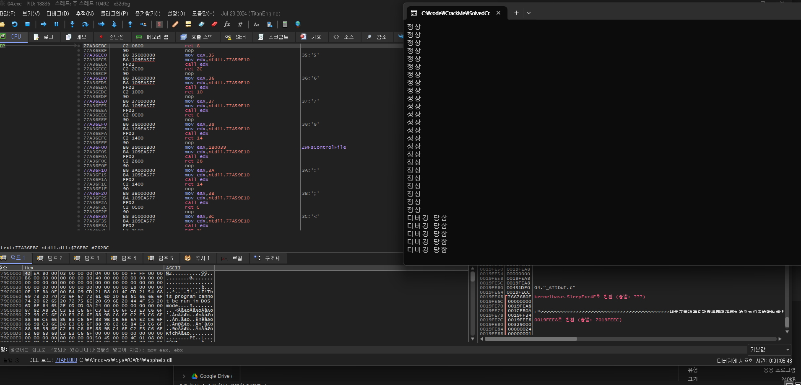
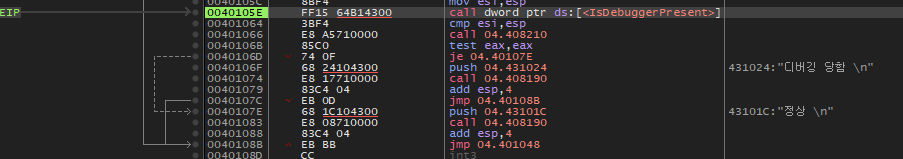
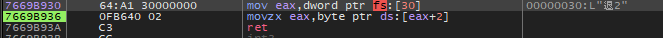

이 프로그램은 디버거 프로그램을 탐지하는 기능을 갖고 있다. 디버거를 탐지하는 함수의 이름은 무엇인가

  
실행하면 "정상"이라는 문자열이 출력되다가 디버거를 붙이면 "디버깅 당함" 이라는 문자열이 출력된다

  
코드 실행흐름을 따라가다 보면 IsDebuggerPresent라는 kernel32.dll에서 임포트된 함수를 확인  
해당 함수 결과에 따라 test eax, eax를 통해 디버깅 여부를 판단한다

문제는 함수 이름을 찾는 것이니 답은 **IsDebuggerPresent**

  
함수 동작을 살펴보니 fs:[30]에서 어떤 주소값을 구한 뒤  
[fs:[30] + 2] 가 참조하는 값을 eax에 반환한다.

검색해보니 0x30은 PEB구조체의 시작 주소이고  
[fs:[30] + 2] 는 BeingDebugged 라는 멤버 변수이다.
