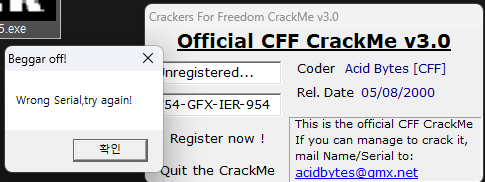
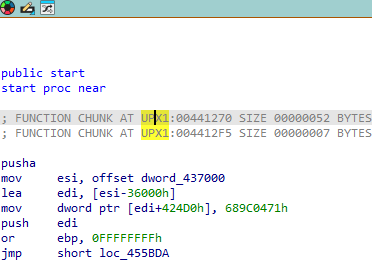
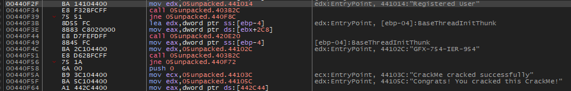
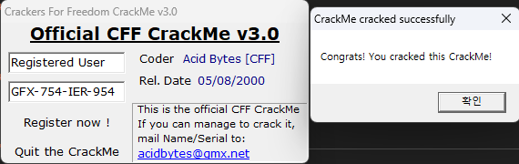
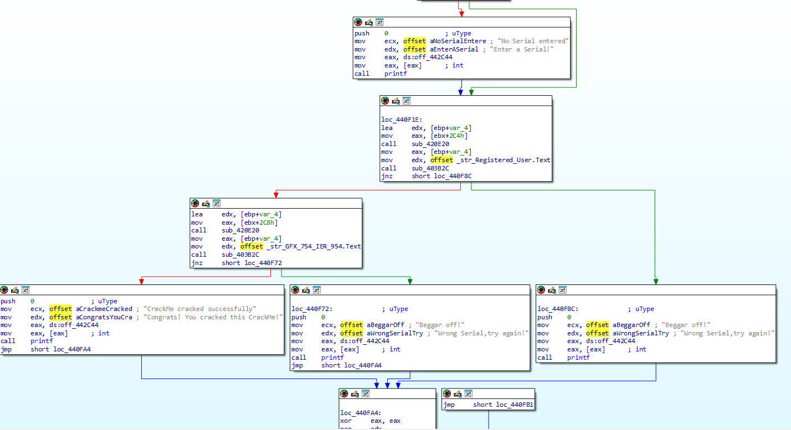

이 프로그램의 등록키는 무엇인가

  
두 문자열이 일치해야 하는 것 같다

  
ida로 열어보니 UPX로 패킹이 된걸 확인  
언패커가 존재하므로 언패킹 후 다시 뜯어보았다

  
문자열을 먼저 검색해보았는데 첫 실행 화면의 GFX 같은 코드와 유사한  
**"GFX-754-IER-954"** **"Registered User"**를 발견

  
무지성 입력으로 성공

  
그래프뷰로 간략하게 보면 유저 입력과 "Registered User"를 비교해서 `jnz short loc_440F8C`를 수행하고
시리얼 입력과 "GFX-754-IER-954"를 비교해서 `jnz short loc_440F72`를 수행하고 둘 다 성공 시 Congrats! 라는 성공 메세지 박스를 출력한다.
