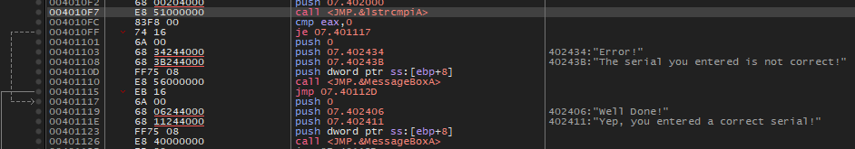
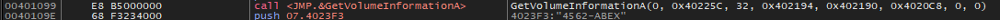
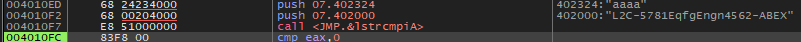

### 컴퓨터 C 드라이브의 이름이 CodeEngn 일경우 시리얼이 생성될때 CodeEngn은 '어떤것'으로 변경되는가

  
이번에는 패킹은 없어서 바로 문자열 부터 찾아보니 lstrcmpiA의 결과에 따라 성공 실패로 분기하는 코드를 찾았다.

  
GetVolumeInformationA(0, 0x40225C, 32, 0x402194, 0x402190, 0x4020C8, 0, 0) 을 수행하는 코드를 찾았다.  
문제의 의도를 생각하면 루트 드라이브의 이름이 저장되는 0x40225C 부분이 중요하다고 판단했다.

  
함수 실행 후 메모리를 수정하여 문제에 맞게 루트 드라이브 이름이 CodeEngn일 경우를 코드 흐름을 보았다.

  
앞서 본 분기문까지 진행해보니 내가 입력한 aaaa와 L2C-5781EqfgEngn4562-ABEX를 비교해서 성공 실패로 분기한다.

고로 정답은 **L2C-5781EqfgEngn4562-ABEX**
