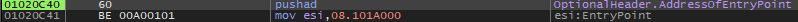

### OEP를 구하시오 Ex) 00400000

  
UPX로 패킹되어 있는 모습이다. UPX 언패커로 언패킹 후 디버거만 붙여도 쉽게 OEP를 구할 수 있다.  
하지만 직접 구해보기로 했다.

  
디버거 붙인 후 실행하여 pushad를 찾고

  
popad를 찾고 맨 아래 점프문에 bp를 건다.  
멈춘곳에서 한 줄 실행하면

01012475가 OEP였다는 것을 알 수 있다.

고로 정답은 **01012475**
