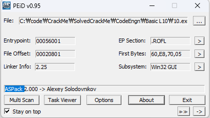
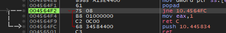
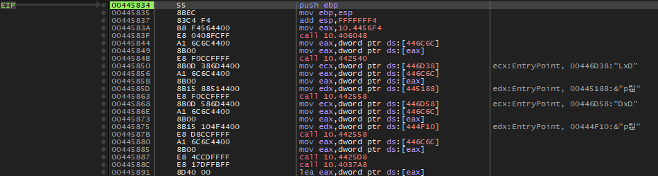
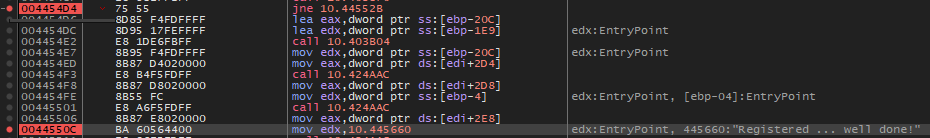

### OEP를 구한 후 '등록성공' 으로 가는 분기점의 OPCODE를 구하시오. 정답인증은 OEP + OPCODE EX) 00400000EB03

  
ASPack 확인

  
esp trick을 사용하여 **OEP = 00445834**를 획득

  
실제 OEP의 모습

  
문자열 검색으로 register을 찾아 분기하는 코드가 **004454D4** 라는 것을 확인  
고로 정답은 **004458347555**
