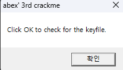
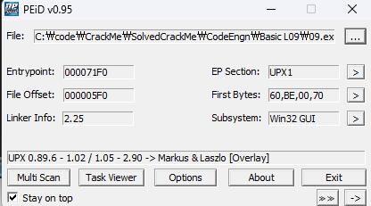
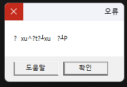
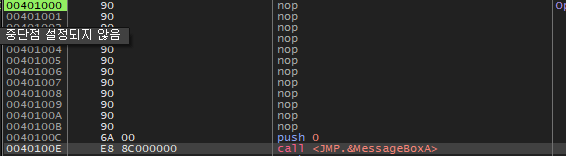
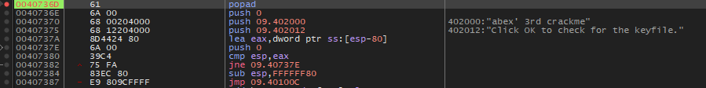
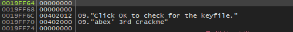

### OEP를 찾으시오. Ex) 00401000 / Stolenbyte 를 찾으시오. Ex) FF35CA204000E84D000000 정답인증은 OEP+ Stolenbyte Ex ) 00401000FF35CA204000E84D000000

  
첫 실행 모습

  
UPX로 패킹되어 있는 모습이다. 먼저 언패킹을 진행한 후 디버거를 붙였다.

  
언패킹을 하니 고장난 모습

  
언패킹 한 파일을 디버거로 열어보면 MessageBoxA 의 인자 부분이 사라진걸 볼 수 있다.

  
패킹된 코드의 popad 부분을 찾아가보면 언패킹된 oep는 0x401000인데 0x40100C로 점프하고,
점프하기 전 스택에 인자들을 세팅하는 모습을 볼 수 있다.

기본적인 언패킹을 방지하는 안티디버깅이 StolenByte이다.

StolenByte는 다음과 같다.  
6A 00  
68 00204000  
68 12204000

고로 정답은 **6A0068002040006812204000**
