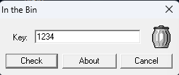
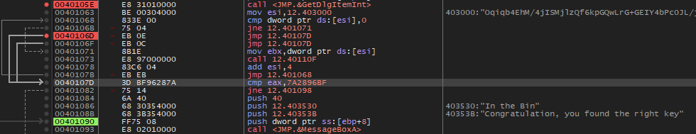
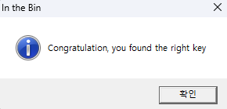
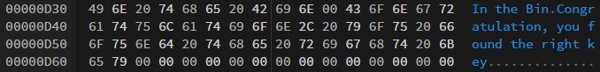

### Key를 구한 후 입력하게 되면 성공메시지를 볼 수 있다. 이때 성공메시지 대신 Key 값이 MessageBox에 출력 되도록 하려면 파일을 HexEdit로 오픈 한 다음 0x???? ~ 0x???? 영역에 Key 값을 overwrite 하면 된다. 문제 : Key값과 + 주소영역을 찾으시오. Ex) 7777777????????

  
실행하면 다음과 같은 UI가 뜨고 1234를 넣고 Check를 눌러봤으나 아무 반응이 없다.

  
"Congratulation" 문자열이 성공메세지라 판단했다.  
도달하기 위해서는 `0040107D (cmp eax, 7A2896BF)` 에서 cmp가 true여야 한다.  
eax는 `0040105E (call <JMP.&GetDlgItemInt>)` 의 리턴값이고 해당 값은 입력한 값을 정수형으로 반환한다.  
1234의 경우 4D2 라는 헥스 값으로 반환이 된다.  
그러니 키 값에 **2049480383** 를 넣으면 성공메세지를 볼 수 있다.

  
성공 메세지를 띄운 모습이다. 하지만 여기서 메세지 대신 Key 값이 출력되도록 해야 하므로 어디를 수정해야 할지 살펴본다.

  
**0D3B ~ 0D45** 영역을 **2049480383** 으로 바꿔주면 된다.

고로 정답은 **20494803830D3B0D45**
