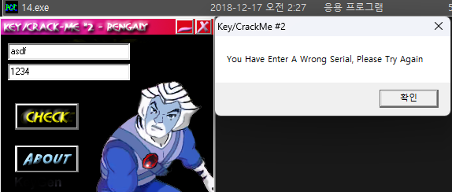
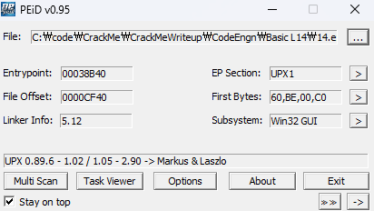
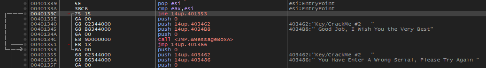
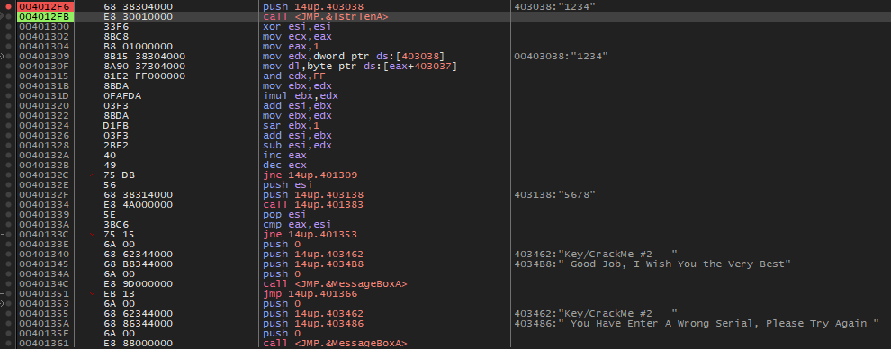
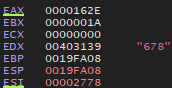
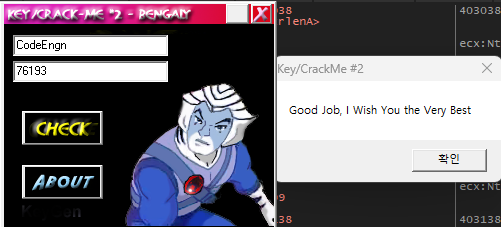

### Name이 CodeEngn 일때 Serial을 구하시오 (이 문제는 정답이 여러개 나올 수 있는 문제이며 5개의 숫자로 되어있는 정답을 찾아야함, bruteforce 필요) Ex) 11111

  
실행하면 다음과 같은 창이 뜨고 두 문자열이 조건에 일치해야 하는 것 같다.

  
UPX 패킹이 되어 있는 모습 간단히 언팩해준 후 디버거를 붙여봤다.

늘 하던대로 문자열을 검색해서 성공 실패 분기문을 찾았고, `cmp eax, esi`에서 두 값이 동일해야 함을 알았다.  
동작을 자세히 보기 위해 해당 루틴의 상단에 bp를 걸고 코드를 따라가보자고 생각했다.

첫 문자열을 "1234", 두 번째를 "5678"으로 넣고 실행한 결과이다. 각 문자열로 어떤 연산을 수행한다.
  
최종적으로 "1234"가 ESI에 2778로 변환되었고 "5678"이 EAX에 162E로 변환되었다.  
문제는 Name이 "CodeEngn"일때 Serial을 구하는 것이고 앞서 Serial값이 "5678"일 때 해당 십진수를 16진수로 변환한 값인 162E가 EAX에 저장되는 것을 확인했다.  
  
Name에 "CodeEngn"을 넣고 ESI 값을 확인하니 "129A1"이 나왔다.  
따라서 이를 다시 십진수로 변환하면 76193이므로 정답은 **76193**

