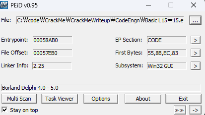
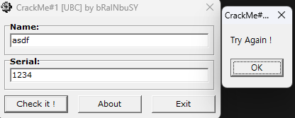
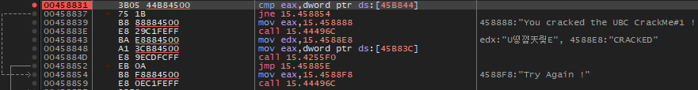
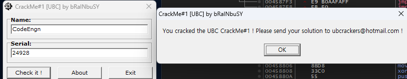

### Name이 CodeEngn일때 Serial을 구하시오

  
Borland Delphi로 개발되었다. 인터넷에 검색해보니 x64dbg로 디버깅이 가능하다고 한다.

  
잘못된 값을 입력하면 Try Again! 이 뜬다. 해당 스트링으로 검색해보면

  
이렇게 eax와 0x45B844를 비교해서 성공 실패로 분기한다.  
Name->asdf, Serial->1234로 cmp에 bp를 걸고 실행하면  
EAX에는 "4D2", 0x45B844에는 "@4"가 담긴다.

"4D2"는 십진수로 1234 이므로 시리얼 값이 그대로 EAX에 담긴다는 것을 알 수 있다.  
Name에 "CodeEngn"을 담으면 0x45B844에 어떤 값이 담기는지 확인해보니 "`a" 라는 값이 담겼다. 무슨 값인지 모르겠어서 덤프를 보니 "00006160"이 담겨있었고 십진수로는 24928이었다.

해당 값을 Serail에 입력해주면
  
성공이다.

정답은 **24928**
