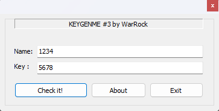
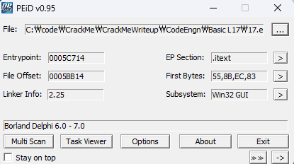
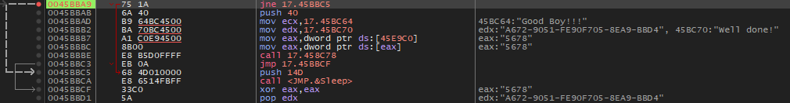
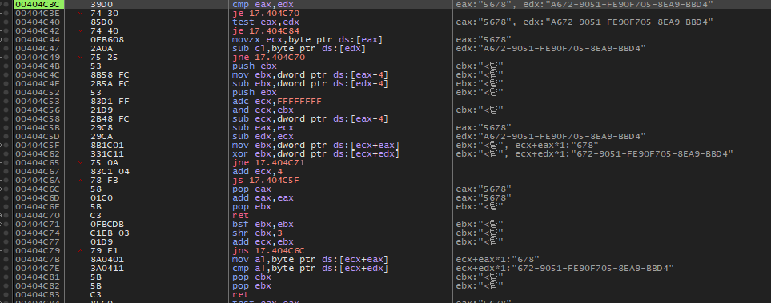
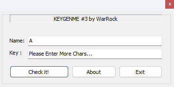
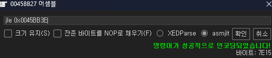
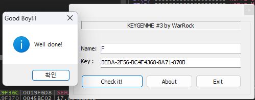
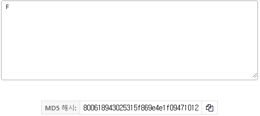

### Key 값이 BEDA-2F56-BC4F4368-8A71-870B 일때 Name은 무엇인가. 힌트 : Name은 한자리인데.. 알파벳일수도 있고 숫자일수도 있고.. 정답인증은 Name의 MD5 해쉬값(대문자)

  
틀린 키를 입력하면 아무 반응이 없다.

  
Delphi로 제작된 것을 확인

  
문자열 검색으로 성공했을 때로 추정되는 "Good Boy"와 점프코드를 찾았다.  
bp를 걸고 Name에 1234 Keydp 5678을 넣어보니  
0045BBA4의 `call 17.45BBC5` 에서 ZF가 0으로 설정되는 것을 확인했다.

  
함수 내부로 따라가 보면 아래와 같은데 넣은 Key값과 edx에 들어있는 시리얼 값과 비교하고 연산을 어떤 연산을 수행한다.  
아직 직관이 서지 않아 문제에서 주어진 조건대로 다시 돌려보았다.

  
그랬더니 한자리는 못넣게 조건이 걸려 있다.

  
조건을 수정해주고 경우의 수가 얼마 안되니 손으로 BruteForce를 해주면

  
"F" 에서 성공  
MD5로 변환하면

  
정답은 **800618943025315f869e4e1f09471012**
