### 이 프로그램은 Key파일을 필요로 하는 프로그램이다. 'Cracked by: CodeEngn!' 문구가 출력 되도록 하려면 crackme3.key 파일안의 데이터는 무엇이 되어야 하는가 Ex) 41424344454647 (정답이 여러개 있는 문제로 인증시 맞지 않다고 나올 경우 Contact로 연락주시면 확인 해드리겠습니다)

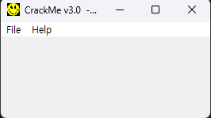  
아무것도 없는 모습이다. 문제에 따르면 crackme3.key 라는 파일을 읽어서 특정 조건을 충족하는지 확인한 후 Cracked by CodeEngn이라는 문구를 출력해주는 것으로 보인다.

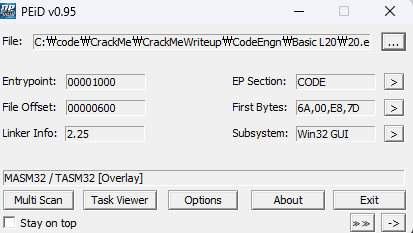  
그냥 디버깅하면 되는것을 확인했고

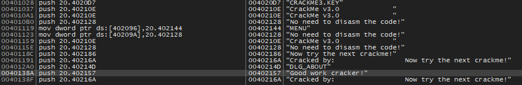  
문자열을 살펴보니 "CRACKME3.KEY"라는 문자열과 "Good work cracker!" 라는 문자열을 살펴보면 되겠다는 생각이 들었다.  
하지만 "Good work" 근처에는 분기문이 보이지 않아 "Now try the next crackme!"로 가보니 익숙한 분기문이 보인다.

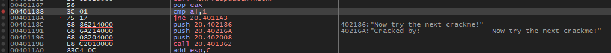  
pop eax 한 후 최하위 비트와 1을 비교하는데 bp를 걸어 확인해보니 EAX는 40210E로 al 값은 E였고 실패한다.

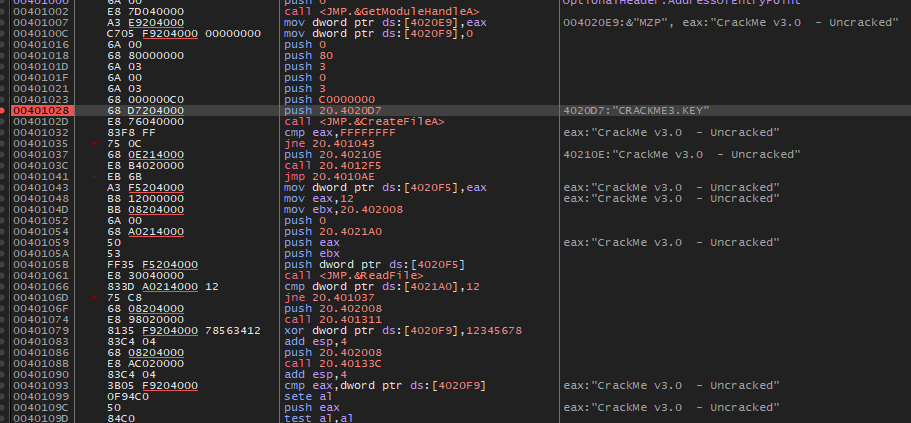  
어떤 경로로 eax가 형성되었는지 보기 위해 쭉 올려 "CRACKME3.KEY" 문자열을 푸시하는 곳에 bp를 걸고 실행했다.

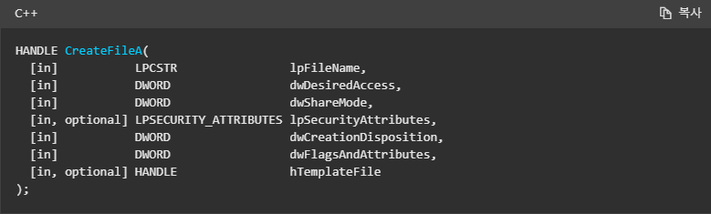  
"CRACKME3.KEY"라는 파일을 열고 ReadFile("CRACKME3.KEY", 0x402008, 12, 0x4021A0, 0)을 수행한다.

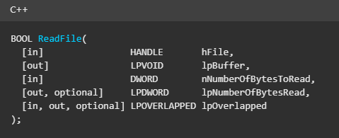  
"CRACKME3.KEY"를 0x12바이트 읽어서 `0x402008`에 결과를 저장하고 읽은 바이트 수를 `0x4021A0`에 저장한다.
그 후 0x12바이트를 읽었는지 확인하고 실패시 끝나는 절차로 진행한다.  
고로 "CRACKME3.KEY"에 `123456789abcdef012`를 넣고 다시 실행했다.

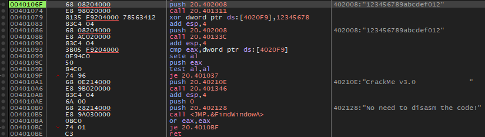  
0x12바이트를 충족시켰으므로 `jne`를 잘 넘어갔다.  
그 후 입력한 문자열을 인자로 0x401311을 실행한다.  
함수 안으로 들어가보았다.

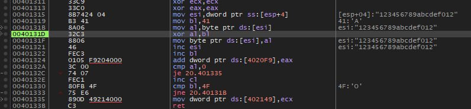  
먼저 'A'와 문자열 첫 문자인 '1'을 xor하여 'p'가 된다. 로직을 분석은 미루고 일단 루프의 결과 값이 `0x4020F9`에 0x12번 더해진다는 것을 확인했다.  
루프가 종료된 후 E가 `0x402149`에 저장된 후 ret로 메인 코드에 복귀한다.

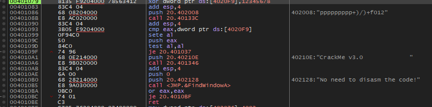  
그 후 `0x4020F9`에 더해졌던 값인 4C7이 12345678을 xor하여 12345EBF가 된다.  
그 후 `0x402008`을 인자로 `call 0x40133C` 후 `cmp EAX 0x4020F9`을 수행한다.  
False인 경우 그대로 종료 루틴에 들어가니 해당 비교문이 참이 되도록 데이터를 입력해야한다.

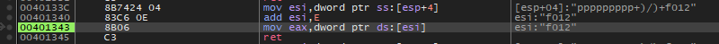  
`call 0x40133C`을 따라가니 `0x402008`에 E를 더한 주소를 참조하여 eax에 저장하고 리턴한다.  
즉 `esi:"ppppppppp+)/)+f012"` 에서 `esi:"f012"`가 된다.

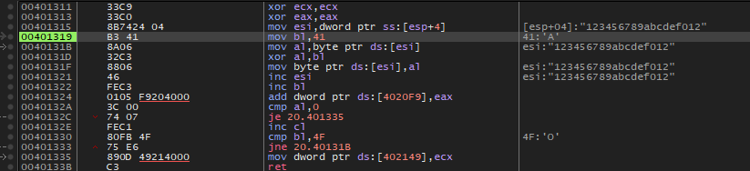  
key값 획득을 위해 아까 미뤄뒀던 함수 분석을 다시 해야한다.  
al=0일 or bl='O'이 될 때 까지 루프를 돈다.  
즉 A~O까지 14번 수행한다. 문자열 개수는 18개이므로 뒤에 4개는 버려지는 값이다. 문제에서 정답이 여러개라는게 아마 이것 때문인 것 같다.

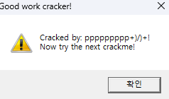  
이 문제는 key값을 맞추는게 아니라 CodeEngn을 출력하는게 목적이므로 일단 조건문을 우회해서 메세지박스를 띄웠다.  
`ppppppppp+)/)+f012` 중에서 `f012`를 제외한 `ppppppppp+)/)+`가 출력되는 것을 확인했다.  
즉 CodeEngn을 먼저 완성하고 앞선 문자열에 따라 변화하는 key를 맞춰야 한다.

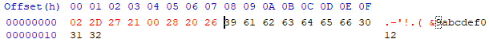  
xor의 성질을 사용하여 "ABCDEFGH"와 "CodeEngn"을 xor하면 [02, 2D, 27, 21, 00, 28, 20, 26]  
hxd를 열어 수정했다.

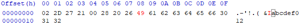  
8번째 바이트에서 al=0 조건을 충족시켜 종료해야하는데, 'I'와 xor을 해서 0이 되는 0x49를 넣어 조건을 충족시켜준다.

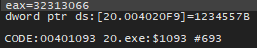  
그후 다시 실행시켜 key값을 비교하는 곳을 보니 `1234557B`가 보인다.

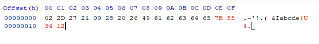  
key 값에 맞춰서 마지막 4바이트를 수정한 후 다시 실행하면

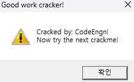  
성공. 정답은 02 2D 27 21 00 28 20 26 49 XX XX XX XX XX 7B 55 34 12  
XX부분에는 어떤 값이 들어가도 상관없다.
