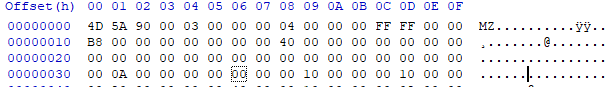
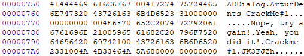
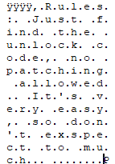

패스워드로 인증하는 실행파일이 손상되어 실행이 안되는 문제가 생겼다. 패스워드가 무엇인지 분석하시오

  
비정상적인 헤더

  
좀 내려보니 Yeah, you did it! 이라는 수상한 문구와 함께 패스워드로 추정되는 문자열 발견

  
이게 맞나 긴가민가해서 내려보니  
Just find the unlock code no patching allowed It's very easy so don't expect too much  
진짜 이게 맞다고 한다
