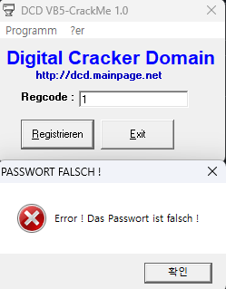
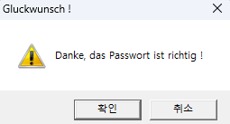

비주얼베이직에서 스트링 비교함수 이름은?

실행해보니 msvbvm50.dll이 없다고 실행이 안된다 VB로 만들어진 프로그램이니 해당 파일을 구해서 실행해줬다.

  
맞는 값을 찾아서 입력해야되나보다

  
ida로 vbaStrCmp를 참조하는 코드를 보니 call하기 직전에  
"2G83G35Hs2"라는 수상한 문자열을 발견

  
입력해주니 성공
