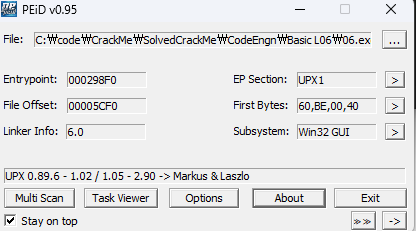
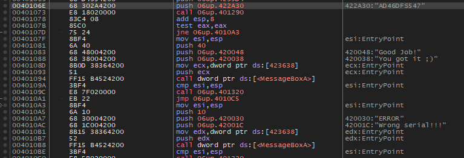

Unpack을 한 후 Serial을 찾으시오. 정답인증은 OEP + Serial Ex) 00400000PASSWORD

  
UPX 패킹 확인 후 언팩

  
문자열을 먼저 검색 후 Good job에 홀린듯이 들어감  
0x401073에 call 0x401290 반환 결과에 따라 Good Job과 Wrong Serial으로 분기하는 것을 확인  
call 0x401290에 "AD46DFS547" 이라는 문자열을 인자로 전달하는 것을 보고 시리얼일 가능성을 생각함

  
성공

정답은 언팩 후 드러나는 OEP인 00401360 + Serial "AD46DFS547" -> **00401360AD46DFS547**
