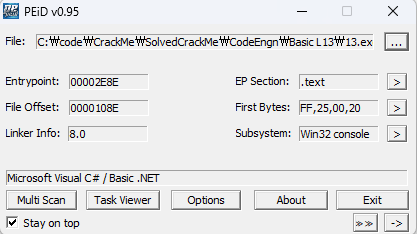
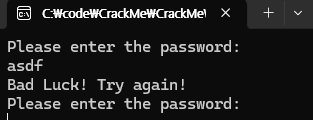
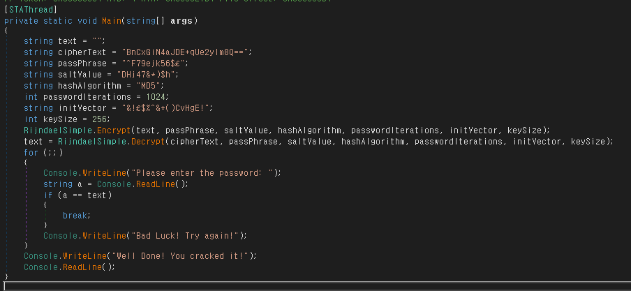
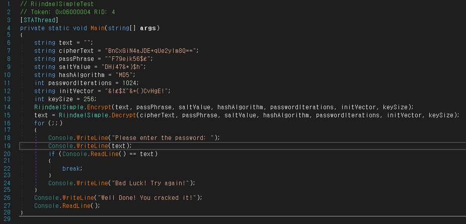
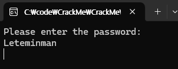

### 정답은 무엇인가

  
먼저 닷넷 프로그램인걸 확인했으니 x64dbg 대신 dnspy를 사용한다.

  
password라는 문자열로 dnspy에서 검색해보면 아래와 같은 main함수를 찾을 수 있다.

asdf를 입력하면 해당 문자열이 `string a`가 되고 `text`와 해당 값이 일치하면 성공이다.  
text는 빈 문자열로 선언되어 Encrypt와 Decrypt 함수를 거쳐 특정 문자열이 된다.  
암호문과 암호 알고리즘이 모두 제공되니 실제로 암호화와 복호화를 실행하여 구해도 되지만,  
간단하게 실행 파일을 수정해서 text가 어떤 값인지 출력하도록 변경할 생각이다.

  
dnspy의 기능을 이용해 수정한 코드이다. enter the password 뒤에 바로 text를 출력해준다.

  
정답은 **Leteminman**
