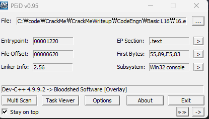
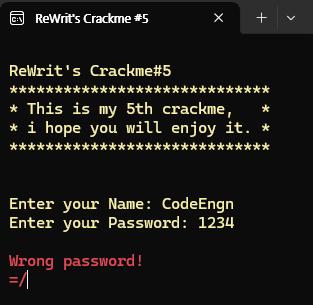
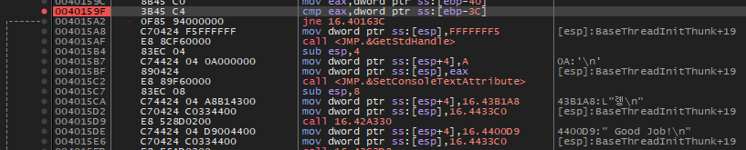
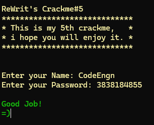

### Name이 CodeEngn일때 Serial을 구하시오

  
PEiD 결과이다. 패킹은 없는 것을 확인.

  
간단하게 실행한 결과 null 이라는 파일이 생성되고 실패 문구와 함께 종료된다.

  
String 검색을 통해 성공 실패 분기하는 `cmp eax, dword ptr ss:[ebp-3c]` 코드를 찾았다.  
bp를 걸고 CodeEngn/1234 입력 쌍에서의 결과를 살펴보니 EAX에는 "4D2" ebp-3c에는 "E4C60D97"가 존재함을 확인.

password인 1234가 4D2로 그대로 들어가는 걸 확인했으니 3838184855를 입력하면 E4C6 0D97가 나올 것이라 생각하여 실험.

  
성공. 정답은 **3838184855**
