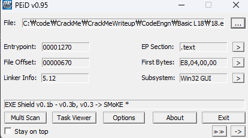
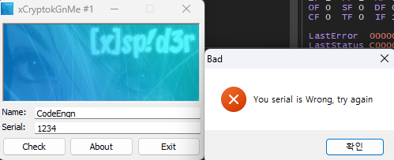
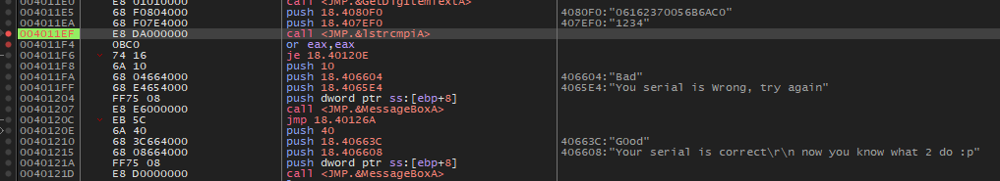
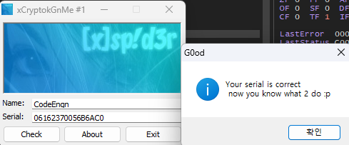

### Name이 CodeEngn일때 Serial은 무엇인가

  
EXE Sheld 라고 한다. 뭔지 몰라서 검색해봤는데 결과가 별게 없는거 보니 일단 패킹은 아닌 것 같아 실행해본다.

  
해당 문자열을 검색해본다.

  
성공 실패 분기문 바로 위에 문자열 비교 함수가 있다.  
입력한 Serial 값인 "1234"와 4080F0:"06162370056B6AC0"를 비교한다.

  
엥 이렇게 쉽게 풀린다고...  
정답은 **06162370056B6AC0**
