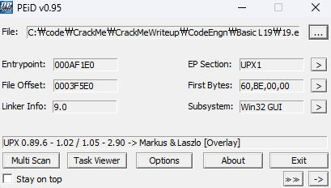
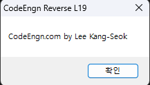
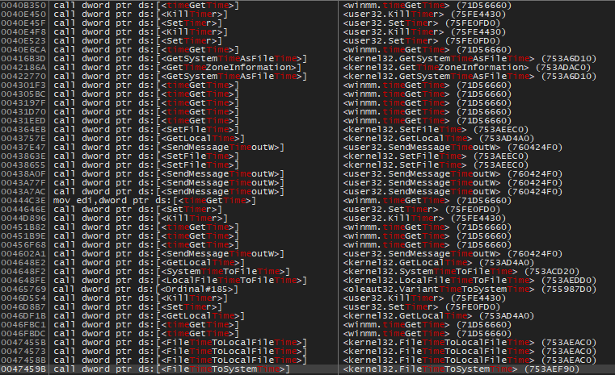
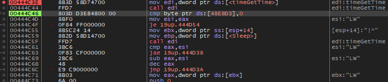

### 이 프로그램은 몇 밀리세컨드 후에 종료 되는가

  
upx 패킹 확인 후 언팩

  
실행하면 이런 메세지와 함께 종료된다.
디버거를 붙여서 문자열 검색을 해봤으나 이번에는 쉽게 문자열을 주지 않는다.

  
해당 함수에서 메세지 박스가 뜬다. 하지만 딱히 근처에 시간 관련한 함수가 보이지 않는다.

  
현재 모듈에서 참조하는 함수들을 "time"으로 검색한 결과이다.  
이 중에서 살펴보아야 할 함수는 밀리초 단위를 지원하는  
`timeGetTime, SetTimer, GetSystemTimeAsFileTime` 세가지 함수이다.  
일단 `timeGetTime`이 딱 봐도 제일 많이 호출되니 여기에 먼저 bp를 걸고 실행했다.

첫 bp는 `00444C3E`에 걸렸다.  
edi에 timeGetTime을 담고 실행  
결과 값인 `EAX: 01C7AD5`을 `esi`에 넣고,  
`ebp`에 `Sleep` 함수를 담고 다시 `timeGetTime`을 실행한 후 `esi`에 담겼던 이전 실행값과 비교한 결과로 00444D38로 점프한다.  
두번째 시간을 첫째 시간에서 빼고 그 값을 `[ebx+4]=2B70` 과 비교한다.  
`2B70`이 더 작으면 `00444C71`로 점프한다. 그후 몇가지 절차 후 메세지박스를 출력하고 종료한다.

맥락상 `0x2B70`이 의미하는 **11120ms**가 정답일거라고 판단하였고 실제로 정답이었다.
