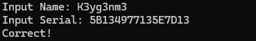

ReversingKr KeygenMe


Find the Name when the Serial is 5B134977135E7D13

   

```python
xorKey = 0x1020301020301020
Serial = 0x5B134977135E7D13

# Serial에 xor_key를 xor 연산한 결과를 출력한다.
xor = Serial ^ xorKey
print(hex(xor))

# xor을 ascii로 변환한다.
print(bytes.fromhex(hex(xor)[2:]).decode())
```
